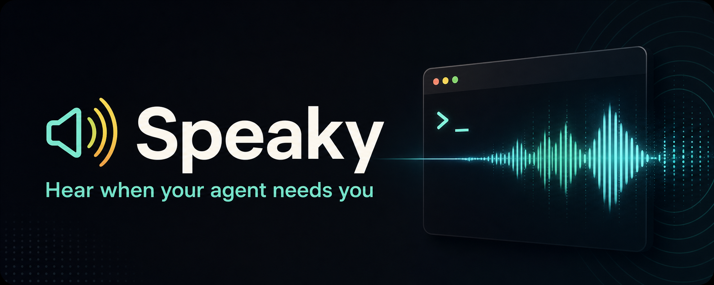

<p align="center">
  
</p>

# Speaky

A skill that lets your **coding agent speak to you out loud** through your
speakers - so you can step away and still know the moment a task finishes or the
agent needs you.

Works with any coding agent that can run a shell command - Claude Code, Cursor,
Codex, Gemini CLI, Aider, or your own scripts. It's just a Python script the
agent calls; drop it wherever your agent loads skills or tools.

It plays a short attention beep, then talks to you like a teammate giving a
quick verbal recap. Two engines:

- **Premium (Gemini TTS)** - an expressive, warm voice that understands emotion
  cues like `[excited]` or `[hesitant]` and natural fillers ("hmm", "umm").
  Needs a free Gemini API key.
- **Native** - your operating system's built-in speech synthesizer. No API key,
  no network, works offline.

Cross-platform: **Windows, macOS, and Linux.** If premium ever fails (no key,
no network, quota), it automatically falls back to the native voice so you're
never left in silence.

---

## Install

Speaky follows the open [Agent Skills](https://agentskills.io) standard, so it works with any compatible coding agent. Pick the method that fits your setup.

### GitHub CLI (any agent)

The `gh skill install` command auto-detects your agent and places the skill in the right directory. Requires [GitHub CLI v2.90+](https://cli.github.com/).

```bash
# Interactive - choose agent and scope when prompted
gh skill install mustafaakben/speaky

# Or specify everything directly
gh skill install mustafaakben/speaky --agent claude-code --scope user
gh skill install mustafaakben/speaky --agent codex --scope user
gh skill install mustafaakben/speaky --agent cursor --scope user
```

### Claude Code

```bash
# Clone into your personal skills directory (available in all projects)
git clone https://github.com/mustafaakben/speaky.git ~/.claude/skills/speaky

# Or into a single project
git clone https://github.com/mustafaakben/speaky.git .claude/skills/speaky
```

### Claude.ai (web)

1. Go to **Customize > Skills**
2. Click **+** then **Create skill**
3. Select **Upload a skill** and upload the repo as a ZIP file
4. Toggle the skill on

### OpenAI Codex

```bash
# User-level (available in all projects)
git clone https://github.com/mustafaakben/speaky.git ~/.codex/skills/speaky

# Or project-level
git clone https://github.com/mustafaakben/speaky.git .codex/skills/speaky
```

### Gemini CLI

```bash
git clone https://github.com/mustafaakben/speaky.git ~/.gemini/skills/speaky
```

### Cursor / VS Code Copilot / Other Agents

Most agents following the Agent Skills standard load skills from a `.agents/skills/` directory in your project or home folder:

```bash
# Project-level
git clone https://github.com/mustafaakben/speaky.git .agents/skills/speaky

# User-level (check your agent's docs for the exact path)
git clone https://github.com/mustafaakben/speaky.git ~/.agents/skills/speaky
```

### After installing (all agents)

```bash
# (Premium only) install the Python dependency
pip install -r requirements.txt

# (Premium only) add your Gemini API key
cp .env.example .env
# then edit .env and paste your GEMINI_API_KEY
```

**Native mode needs no extra install** on macOS and Windows. On Linux, install a synthesizer:

```bash
# Debian/Ubuntu
sudo apt install speech-dispatcher    # provides spd-say
# or
sudo apt install espeak-ng
```

Get a free Gemini API key at <https://aistudio.google.com/apikey>.

---

## Usage

```bash
# Auto: premium if GEMINI_API_KEY is set, otherwise native
python scripts/speak.py "[excited] Hey - the build's green and deployed! Ship it!"

# Force native (offline, no key)
python scripts/speak.py "Done with the refactor." --mode native

# Force premium with an emotion cue
python scripts/speak.py "[relieved] Phew, all the tests pass now." --mode premium

# Pick a voice by vibe, and use the free-tier model
python scripts/speak.py "Deploy's done." --voice warm --free

# See all voices and aliases
python scripts/speak.py --list-voices
```

Your agent runs this for you - but you can run it directly to test.

### Options

| Flag | Purpose |
|------|---------|
| `--mode auto\|native\|premium` | Which engine to use (default `auto`) |
| `--style "..."` | Override the delivery style (premium) |
| `--voice NAME` | Gemini voice or alias - `warm`, `deep`, `energetic`, `bright`, `upbeat`, `friendly`, `gentle`, `firm`, `smooth` (default `Enceladus`) |
| `--list-voices` | Print all 30 voices + aliases and exit |
| `--model NAME` | `flash` (default, most expressive) · `free` (2.5-flash, free tier) · `pro` |
| `--free` | Shortcut for `--model free` |
| `--no-beep` | Skip the attention beeps |
| `--no-play` | Generate the WAV without playing it (premium) |
| `--out PATH` | Save the WAV to a specific path (premium) |

### Configuration (env vars)

| Variable | Purpose |
|----------|---------|
| `GEMINI_API_KEY` | Required for premium mode |
| `SPEAKY_VOICE` | Default Gemini voice (default `Enceladus`) |
| `SPEAKY_STYLE` | Default premium delivery style |

---

## Emotional voice (the killer feature)

Premium mode doesn't just read text - it **acts**. Drop an emotion tag in square
brackets and the Gemini voice delivers the line with real feeling:

```bash
python scripts/speak.py "[excited] Hey - the build's green and everything deployed clean!" --mode premium
python scripts/speak.py "[sheepish] So, umm... I broke the migration. Give me five to fix it." --mode premium
python scripts/speak.py "[hesitant] The tests pass, but hmm, I'm not sure about that edge case." --mode premium
```

Match the tag to what actually happened:

| Situation | Tag it like |
|-----------|-------------|
| Task done, went great | `[excited]` `[proud]` `[relieved]` |
| Something broke / stuck | `[worried]` `[frustrated]` `[sheepish]` |
| Made a mistake | `[guilty]` `[apologetic]` |
| Unsure, needs a decision | `[hesitant]` `[thoughtful]` |
| Long grind finally over | `[tired]` `[relieved]` |

Use **any** emotion word - the list is a starting point. Layer in fillers
(`hmm`, `umm`, `okay so...`) for a natural, human delivery.

**Beyond emotions**, the premium model understands 200+ inline delivery tags:

- **Actions:** `[whispers]` `[laughs]` `[sighs]` `[gasp]` `[shouting]` `[sarcastic]`
- **Pacing:** `[slow]` `[fast]` `[extremely fast]`
- **Pauses:** `[short pause]` `[medium pause]` `[long pause]`

```bash
python scripts/speak.py "[whispers] psst... [long pause] the deploy's done. [excited] It's live!"
```

> **All tags are premium-only.** Native OS voices can't act, so the script
> strips `[...]` tags automatically before native playback - you'll never hear
> "bracket excited" read aloud.

---

## How it works

| Concern | Windows | macOS | Linux |
|---|---|---|---|
| Native voice | PowerShell `System.Speech` | `say` | `spd-say` → `espeak` |
| WAV playback (premium) | `winsound` | `afplay` | `paplay`/`aplay`/`ffplay` |
| Attention beeps | `winsound.Beep` | synthesized tone | synthesized tone |

Emotion tags like `[hesitant]` are Gemini cues. In native mode the script
strips them automatically so they're never read aloud literally.

**Notes on premium mode:** a ~10-second clip costs roughly half a cent on the
default `flash` model (or use `--free` for the 2.5-flash tier). All Gemini audio
is invisibly watermarked with [SynthID](https://deepmind.google/technologies/synthid/)
to mark it as AI-generated.

---

## Troubleshooting

- **"No native speech synthesizer found" (Linux):** install `speech-dispatcher`
  or `espeak-ng` (see Install).
- **"No audio player found" (Linux, premium):** install `pulseaudio-utils`
  (`paplay`), `alsa-utils` (`aplay`), or `ffmpeg` (`ffplay`).
- **Premium silently uses native:** `GEMINI_API_KEY` isn't set or is invalid -
  the script prints the reason to stderr before falling back.
- **`ImportError: cannot import name 'genai' from 'google'`:** the required
  package is `google-genai` (the new Google SDK), not the older
  `google-generativeai`. Run `pip install -r requirements.txt` to get the
  right one.
- **Running under WSL:** speaky detects WSL and routes audio through Windows
  automatically (Windows `SoundPlayer` for playback, `System.Speech` for the
  native voice), so you don't need a Linux audio stack inside WSL.

---

## Citation

If you use this skill in your work, please cite it.

**APA**

> Akben, M. (2026). *Speaky: A voice-notification skill for AI coding agents* [Computer software]. GitHub. https://github.com/mustafaakben/speaky

**BibTeX**

```bibtex
@software{akben_speaky_2026,
  author  = {Akben, Mustafa},
  title   = {Speaky: A voice-notification skill for AI coding agents},
  year    = {2026},
  url     = {https://github.com/mustafaakben/speaky},
  version = {1.0.0}
}
```

Maintained by **Mustafa Akben, PhD** - Assistant Professor of Management &
Director of AI Integration.

---

## License

Released under the [MIT License](LICENSE).
